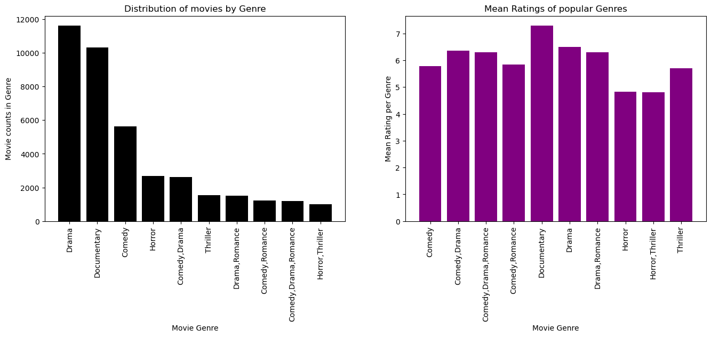
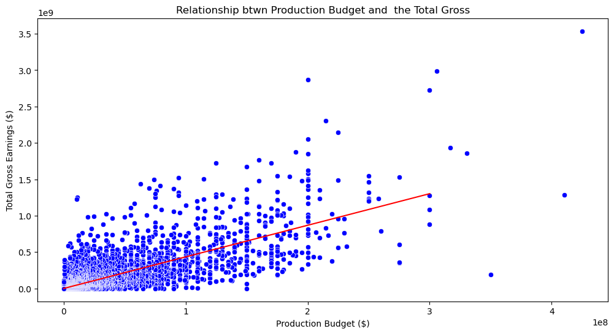
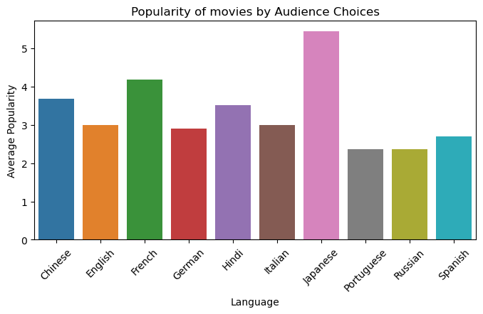

# Bandersnatch_Movie_Studios
Movie studio company analysis
### Overview
This project will put into application various aspects of Data science such as Data cleaning , Exploratory Data Analysis , Hypothesis testing , statistics and linear regression .This will enable Bandersnatch Stusios understand the pros and cons of creating a new movie studio and navigate the market to ensure maximum profit on investment. Bandersnatch studios can use this analysis to determine the best categories to venture into, favourable languages to produce movies in, appropriate runtime and suitable markets to penetrate into so as to increase their company's revenue and reach more audiences.

### Business Understanding
The overall goal for any business entity is to make profit while providing services. Since this is a new venture we need to take a minute to understand the logistics behind movie production. There already exists other Movie studios in the film industry already such as Paramount Pictures and Warner Bros, they will likely be some of the studios that we should use as blueprints and may be one of main competitions for Bandersnatch studios.There are some legal requirements when starting a Movie Studio such as getting the licenses and copyright laws etc.

After putting all this into consideration Bandersnatch can now look at some behind the scenes activity in movie productions.

### Data Understanding

For this analysis we are making use of data collected from the following sites:

Box Office(https://www.boxofficemojo.com/) 
IMDB(https://www.imdb.com/) 
Rotten Tomatoes(https://www.rottentomatoes.com/) 
TheMovieDB(https://www.themoviedb.org/)  
The Numbers (https://www.the-numbers.com/)

## IMDB's Database structure
IMDB has one of the largest databases of movies available. 
Data used here include Tables such as basic movie information (movie_basics), alternative movie titles (movie_akas), 
and movie directors and their respective names (directors & persons).

## Findings
### Investigation I : What Genres are the best to venture into ?

Suggestion 1
The ideal genres to invest in more are drama and documentary, according to our study above, since these two categories have the highest average ratings and the greatest amount of films produced in them by other studios.

## Investigation II: How much to Invest in a Movie Production ?

Suggestion 2

We can infer from the illustration above  that a movie's overall gross earnings increase with the amount invested in its production.
Bandersnatch studios should put more money into the film's production if they want to see a larger return on their investment.Our data indicates that investing an average of $350,000,000 in a movie's production can potentially provide a total revenue of over $1 billion, making it a wise investment for the corporation.

### Investigation III : What is the relationship between a Movie Language and the popularity with Audience ?

Suggestion 3
Bandersnatch studios should majorly focus on producing movies in the following languages :
* English
* Japanese 
* French

English dominates in the language of movie creation, showing its widespread use in the industry, based on an analysis of movie popularity across several languages. But even with a large number of English-language films, Japanese films have the highest average rating, making them stand out. This suggests that, on average, Japanese films receive more positive reviews or are more well-liked by viewers, exposing a disparity between the number of films produced and their level of popularity. This result highlights that other elements that contribute to a film's success and appeal also have an impact on its quality and reception, regardless of the language used during production

OVERALL RECOMMENDATIONS
After doing our analysis based on the data we had and focusing on a few aspects, to ensure high return on its investment when creating a studio and smooth transition into this new venture Bandersnatch studios can make use of this analysis and do the following:

* Produce movies in the Drama and Documentary Genre as they proved to be the most popular
* Put an investment of about $350,000,000 or more in the production of a movie
* Produce movies in English, French and Japanese languages

